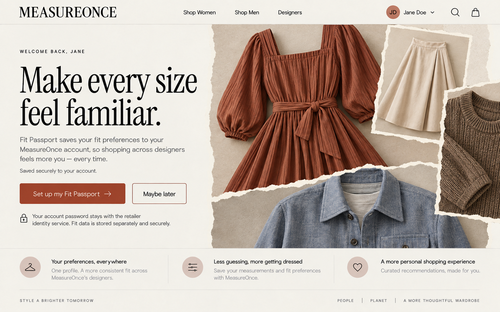
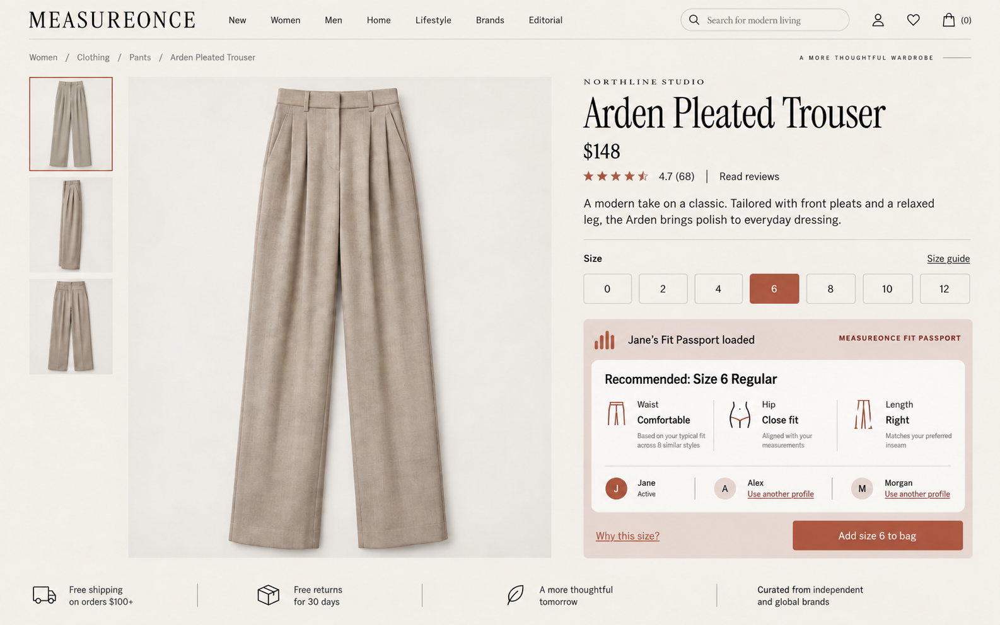
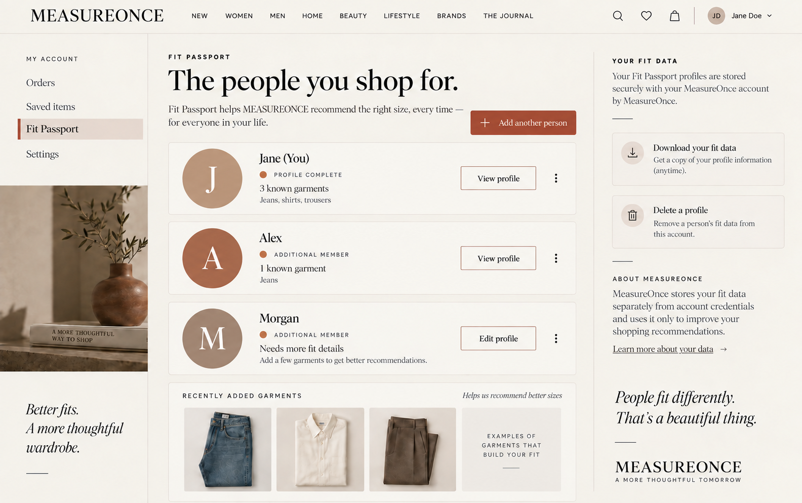
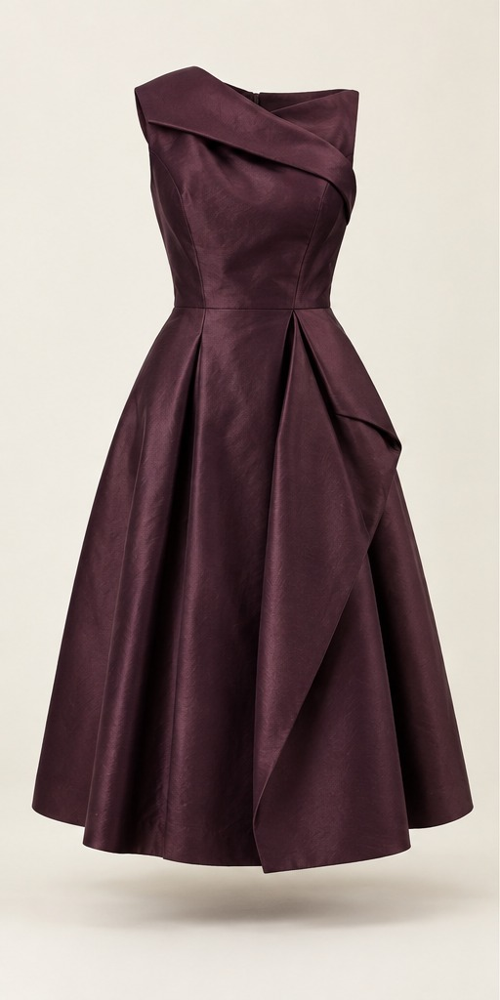
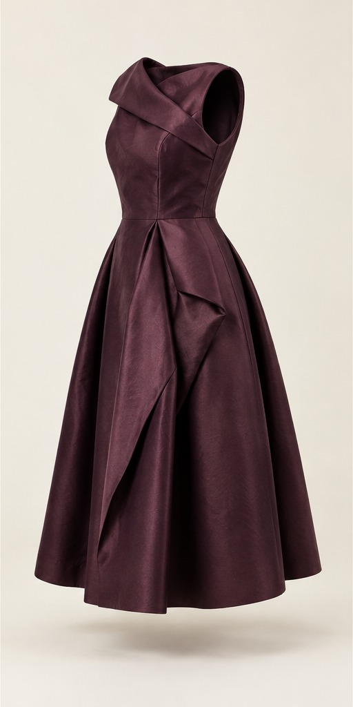
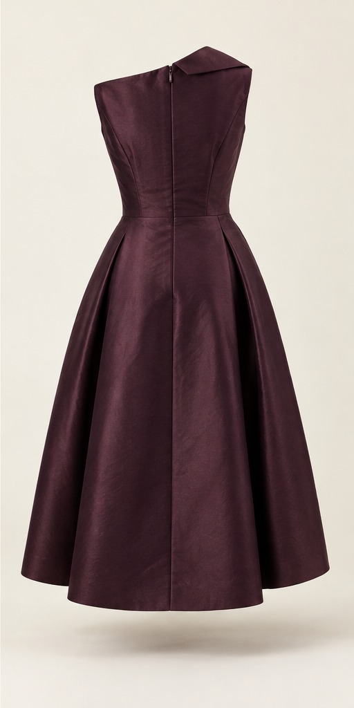

# MeasureOnce

<div align="center">
  

  <p><strong>A deterministic, evidence-led apparel fit prototype for shopping across brands.</strong></p>

  <p>
    <a href="#about-the-project">About</a> ·
    <a href="#product-tour">Product tour</a> ·
    <a href="#results-and-evaluation">Results</a> ·
    <a href="#getting-started">Run locally</a> ·
    <a href="https://github.com/MeasureOnce-Fit/MeasureOnce/issues">Report an issue</a>
  </p>

  
  
  
  
</div>

## About the project

MeasureOnce explores a simple question: can one reusable Fit Passport help a shopper choose a defensible size across different apparel brands?

**Live prototype:** [measureonce.vercel.app](https://measureonce.vercel.app)

The prototype combines a fictional multi-brand storefront with a deterministic fit engine. A shopper can create profiles for themselves or other people, save body measurements or a known size, describe how that garment fits, and request a recommendation for a catalog item. The engine only recommends a size when the selected evidence and a versioned size chart support it; otherwise it explains what is missing instead of inventing certainty.

### What is included

- 200 original fictional garments: 100 women’s and 100 men’s styles.
- 600 locally stored product images with front, side, and back views.
- 10 synthetic brands and 2,028 exact size variants.
- Durable Fit Passport profiles backed by Supabase, including collection preferences and consent-aware storage.
- Known-size, garment-measurement, and body-measurement evidence paths.
- Seven explicit recommendation states with region-level explanations and no opaque confidence score.
- A responsive storefront, product drawers, profile management, authentication, and retailer-oriented demo flows.

## Product tour

<table>
  <tr>
    <td width="50%"></td>
    <td width="50%"></td>
  </tr>
  <tr>
    <td align="center"><strong>Explainable recommendations</strong></td>
    <td align="center"><strong>Reusable shopper profiles</strong></td>
  </tr>
</table>

<table>
  <tr>
    <td width="33%"></td>
    <td width="33%"></td>
    <td width="33%"></td>
  </tr>
</table>

The garment photography, products, brands, prices, measurements, shopper profiles, and evaluation cases are synthetic portfolio content. Product photos are never used as measurement evidence.

## How fit decisions work

1. Select a shopper profile and the product being considered.
2. Reuse a verified known-size reference, enter garment measurements, or provide body measurements.
3. Normalize units and measurement kinds without collapsing distinct labels such as `0`, `2`, and `XS`.
4. Compare the available evidence with the target item’s versioned size chart.
5. Return a recommendation, trade-off, or an explicit explanation of the missing or conflicting evidence.

Composite labels remain evidence-bound: the engine will not choose an inseam, sleeve, or garment length from an unrelated measurement.

## Results and evaluation

The checked-in evaluation artifacts measure deterministic behavior against declared synthetic rules.

| Evaluation | Result |
| --- | ---: |
| Catalog validation | Passed |
| Synthetic brands | 10 |
| Source styles | 200 |
| Exact size variants | 2,028 |
| Generated executions | 618 |
| Contract fixtures | 44 / 44 passed |
| Deterministic engine state agreement | 100.0% |
| Always-answer baseline state agreement | 84.1% |
| Recommendation coverage | 86.4% |
| Exact sellable-label agreement on reviewed cases | 100.0% |

The literal contract review is still awaiting collaborator signoff. These results demonstrate software behavior on synthetic fixtures; they do **not** establish physical fit accuracy, return reduction, conversion lift, commercial impact, or production readiness.

Detailed evidence:

- [M1 fit evaluation](artifacts/evaluation/m1-fit-evaluation.md)
- [M6 baseline evaluation](artifacts/evaluation/m6-baseline-evaluation.md)
- [Fit Passport design QA](docs/design/design-qa.md)

## Built with

- [Next.js](https://nextjs.org/) 16 and [React](https://react.dev/) 19
- [TypeScript](https://www.typescriptlang.org/)
- [Supabase](https://supabase.com/) for authentication and durable profile storage
- [Zod](https://zod.dev/) for runtime validation
- [Lucide](https://lucide.dev/) for interface icons

## Getting started

### Prerequisites

- Node.js 20 or newer
- npm
- A Supabase project for authentication and durable Fit Passport features

### Installation

1. Clone the repository.

   ```bash
   git clone https://github.com/MeasureOnce-Fit/MeasureOnce.git
   cd MeasureOnce
   ```

2. Install dependencies.

   ```bash
   npm install
   ```

3. Create `.env.local` and add the Supabase URL, public key, server credentials, and application secrets described in [the Supabase setup guide](docs/setup/supabase-m2.md). Never commit this file.

4. Apply the checked-in migrations from [`supabase/migrations`](supabase/migrations) to the Supabase project.

5. Start the development server.

   ```bash
   npm run dev
   ```

6. Open [http://localhost:3000](http://localhost:3000).

## Validation

```bash
npm run typecheck
npm run lint
npm run build
npm run test:fit
npm run test:identity
npm run test:identity-repository
npm run test:retailer-identity
npm run test:retailer-catalog
npm run eval:fit
npm run eval:m6
```

Evaluation commands update the machine-readable and human-readable evidence under [`artifacts/evaluation`](artifacts/evaluation).

## Project structure

```text
src/                    Next.js application, fit engine, and domain services
tests/                  Fit, identity, and retailer test suites
public/                 Local product imagery and design references
supabase/migrations/    Versioned database schema
scripts/                Catalog, seed, verification, and evaluation tools
artifacts/evaluation/   Checked-in evaluation reports
docs/design/            UX contract, visual QA, and design-tool configuration
docs/setup/             Environment and Supabase setup
docs/research/          Product and technical research
```

Build-critical files remain at the repository root. The specialized `tsconfig.*-tests.json` files are required by the corresponding npm test commands.

## Roadmap

- [x] Synthetic multi-brand catalog and local product imagery
- [x] Deterministic, evidence-aware fit engine
- [x] Fit Passport profiles and known-size evidence
- [x] Synthetic evaluation and baseline comparison
- [ ] Independent collaborator signoff for all current contract fingerprints
- [ ] Real-world measurement validation with consented data
- [ ] Production monitoring, privacy review, and retailer integration hardening

See [open issues](https://github.com/MeasureOnce-Fit/MeasureOnce/issues) for proposed work and known problems.

## Contributing

Contributions and reproducible bug reports are welcome. Fork the repository, create a focused branch, run the relevant validation commands, and open a pull request that explains the behavior change and its evidence.

## Contributors

- **Lekhureddy** — project contributor.

## License

Distributed under the MIT License. See [`LICENSE`](LICENSE) for details.

## Acknowledgments

- README organization adapted from [Best-README-Template](https://github.com/othneildrew/Best-README-Template).
- Interface icons are provided by [Lucide](https://lucide.dev/).
- The application uses original fictional brands and AI-generated portfolio imagery; no third-party retailer catalog is represented.

<p align="right"><a href="#measureonce">Back to top</a></p>
